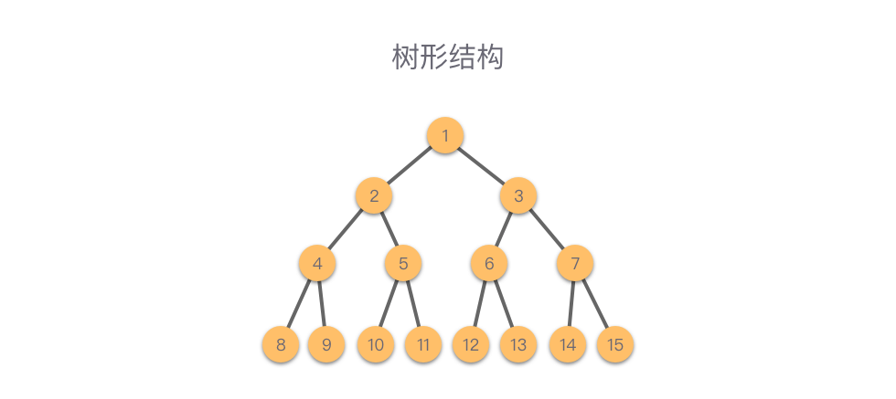

# 算法基础
## 1. 数据结构
数据结构即数据的组织结构，用来组织、存储数据。  
### 1.1 数据逻辑结构
1. 集合结构：集合中元素是无序的，每个元素都是唯一的，没有相同元素。  

2. 线性结构：元素一对一，左侧右侧只有一个元素相连，组成一条线，线性结构类型包括：数组、链表、栈、队列、哈希表。  

3. 树形结构：元素间是一对多的层次关系，例如二叉树等各种树。  

4. 图形结构：元素是多对多关系，一个图是由节点和边组成，图形结构类型包括：无向图、有向图、连通图等。  

### 1.2 数据物理结构
1. 顺序存储结构：将数据元素存放在一片连续的存储单元里