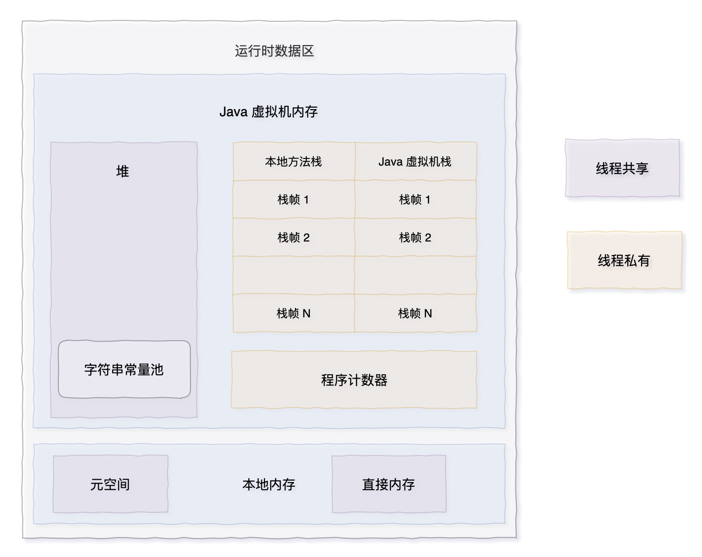
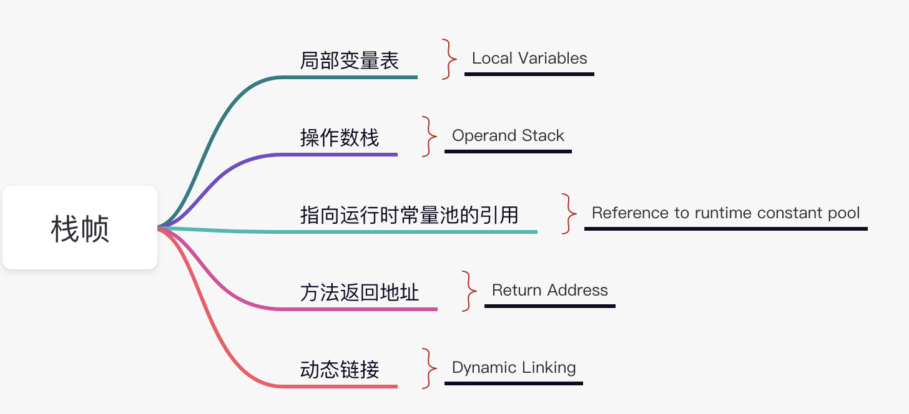
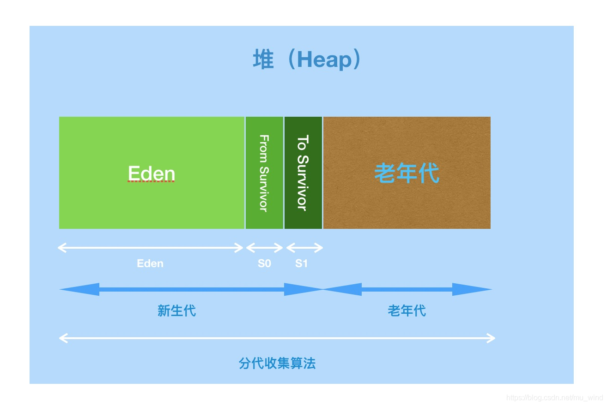

# JVM
## 类加载器
一个Java类到最后被我们使用，需要经过编译、加载的过程，才能变成一个Class对象。  
类加载器就是负责加载过程的，JVM启动时会自动创建三种类加载器：  
- 启动类加载器（Bootstrap ClassLoader）：Java核心类库加载
- 扩展类加载器（Extension ClassLoader）：Java ext目录下的jar包和类文件
- 应用类加载器（Application ClassLoader）：当前应用ClassPath下的所有Jar包和类文件

除了以上三种外，我们还可以创建自定义的类加载器。  

### 双亲委派
ClassLoader里的loadClass方法实现了该逻辑。  
当前ClassLoader加载类时，会首先调用父级加载器的加载方法，一直到启动类加载器，当前加载器差不倒时，才会逐层执行子级加载器方法。  
- 避免核心类被修改
- 避免Class重复加载

在双亲委派的基础上，可能会出现BootstrapClassLoader 需要读取应用类加载器的情况，比如java.lang.Driver的数据库驱动，具体实现都是不同厂商自己做的。  

### 如何破坏双亲委派
- 继承ClassLoader类，重写laodClass方法，在方法中自定义要使用的类加载器
- 设置当前线程的ContextClassLoader

## 内存结构
Java文件经过编译器后编译成字节码文件，然后交给JVM执行引擎运行，运行时会在内存里创建一块区域存储运行时数据，一般来讲我们在聊的JVM内存就是指这块运行时数据区，它包含以下结构。

### 程序计数器
存储当前线程所执行的字节码指令地址，字节码执行器会通过改变该地址获取下一条指令。  

《Java 虚拟机规范》中规定，如果线程执行的是非本地（native）方法，则程序计数器中保存的是当前需要执行的指令地址；如果线程执行的是本地方法，则程序计数器中的值是 undefined。

为什么本地方法在程序计数器中的值是 undefined 的？因为本地方法大多是通过 C/C++ 实现的，并未编译成需要执行的字节码指令。

由于程序计数器中存储的数据所占的空间不会随程序的执行而发生大小上的改变，因此，程序计数器是不会发生内存溢出现象（OutOfMemory）的。

### 栈
也叫Java虚拟机栈，栈中是一个个栈帧，每个栈帧对应一个被调用的方法，当线程执行一个方法时，会创建一个新的栈帧，并压入栈中。方法执行完毕后，将栈帧移出。栈遵循后进先出的原则，所以当前线程正在执行的方法一定在栈顶。

### 堆
堆是所有线程共享的一块内存区域，在JVM启动时创建，用来存储对象。  

堆是 Java 垃圾收集器管理的主要区域，因此也被称作 GC 堆（Garbage Collected Heap）。从垃圾回收的角度来看，由于垃圾收集器基本都采用了分代垃圾收集的算法，所以堆还可以细分为：新生代和老年代。新生代还可以细分为：Eden 空间、From Survivor、To Survivor 空间等。进一步划分的目的是更好地回收内存，或者更快地分配内存。

 
- 堆的GC操作采用分代收集算法。
- 堆区分了新生代和老年代。
- 新生代又分为：Eden空间、From Survivor（S0）空间、To Survivor（S1）空间。

- 方法区
- 本地方法栈