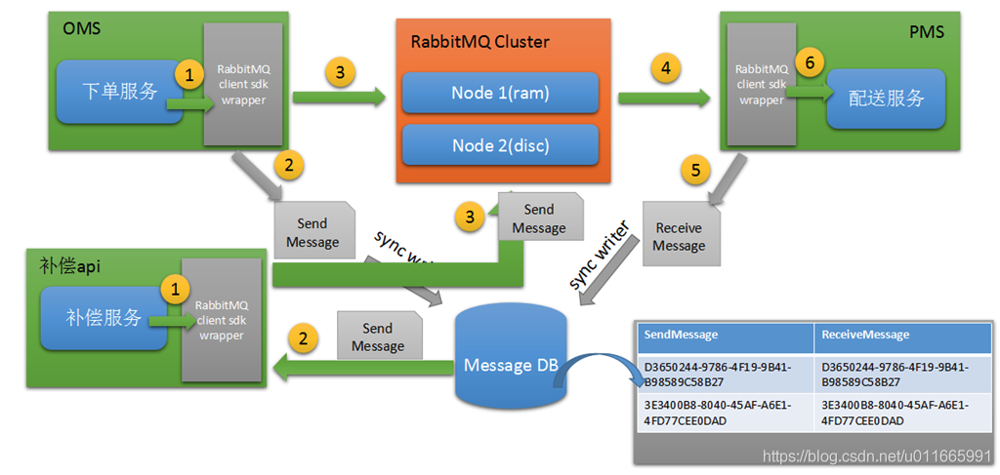

# RabbitMq
- [RabbitMq](#rabbitmq)
  - [优缺点](#优缺点)
  - [RabbitMq如何保证消息不丢失](#rabbitmq如何保证消息不丢失)
    - [机制1：发送确认机制](#机制1发送确认机制)
    - [机制2：消息持久化](#机制2消息持久化)
    - [机制3：ACK确认机制](#机制3ack确认机制)
    - [机制4：设置集群镜像模式](#机制4设置集群镜像模式)
    - [机制5：死信队列](#机制5死信队列)
    - [如何配置死信队列](#如何配置死信队列)
    - [死信队列的应用场景](#死信队列的应用场景)
    - [机制6：消息补偿机制](#机制6消息补偿机制)
  - [信道](#信道)

## 优缺点
优点：
- 异步处理：提高吞吐量
- 应用解耦：通过消息通信，不关心其他系统处理
- 流量削峰：通过消息队列控制请求量，缓解短时间的高并发请求

缺点：
- 降低系统可用性
- 提高系统复杂度
- 出现数据一致性问题

## RabbitMq如何保证消息不丢失
先说明可能会导致消息丢失的几种场景。
1. 发送者到RabbitMq
2. Broker节点重启、宕机，消息丢失
3. 消费者接收消息后宕机，丢失

### 机制1：发送确认机制
生产者把信道设置为confirm 确认模式，所有在该信道发布的消息都会被指定一个唯一ID，一旦被投递到所匹配的队列后，RabbitMQ会发送一个确认（Basic.Ack）给生产者，这样生产者就知道消息到达对应的目的地了。

### 机制2：消息持久化
RabbitMq消息默认配置是存储在内存里，不特别声明时，消息不会持久化到硬盘上，节点重启就丢失了。

要做到消息持久化，必须满足一下三个条件
- Exchange设置持久化
- Queue设置持久化
- Message持久化返送：发送时设置deliveryMode=2，代表持久化消息

持久化必然会带来性能的下降，如果希望单机10w/s以上的消息吞吐量，要么放弃持久化，要么用SSD做磁盘存储。

### 机制3：ACK确认机制
默认ack及时开启的，但是Consumer又默认是自动提交确认，需要改成手动。

ack是指消费者消费完成后，响应给Broker一个ack消息，Broker收到后才会将Message删除，如果消费者宕机的话，超时后其他Consumer可以继续消费。

### 机制4：设置集群镜像模式
1.普通模式：默认的集群模式，某个节点挂了，该节点上的消息无法消费，导致受影响的业务瘫痪。  
这个普通模式的方案不涉及到同步，创建的queue只会在一个RabbitMQ实例节点上，但是每个实例都会同步queue的元数据。

消费的时候如果链接到了另一个实例，那个实例就会从queue所在的实例上拉取数据过来，这个方案主要是为了提高吞吐流量，降低负载策略的实现难度。

2.镜像模式：把需要的队列做成“镜像队列”，存在于多个节点，本质是一个HA方案。  
与普通模式不同的是，除了queue的元数据，消息也会存在于多个实例上，每个节点都有这个queue的一个完整镜像。

镜像模式的HA策略有三种：
- 同步至所有节点
- 同步最多N个机器
- 只同步至符合指定名称的nodes

缺点是性能消耗过大，消息需要同步到所有机器。

### 机制5：死信队列
死信（Dead Letter）是指被丢弃、无法处理的消息。  
当消费消息时，出现以下情况，消息会被转发到死信队列。
- 消息被否定确认，使用channel.basicNack 或 channel.basicReject，并且requeue属性被设置为false
- 消息在队列存活时间超过设置的TTL仍无法消费
- 消息队列的消息数量已经超过最大队列长度

“死信”消息会被RabbitMQ特殊处理，如果配置了死信队列，那么该消息将被转发至私信队列，如果没有配置，消息会被丢弃。

### 如何配置死信队列
首先要说明死信队列是正常的队列，与业务队列没有区别，只是它被用来放死信消息而已。因此相应的，该队列要挂到交换机上，该交换机也被叫做死信交换机。

在创建正常业务queue时，要指定死信交换机、routing-key即可。
- x-dead-letter-exchange
- x-dead-letter-routing-key（非必填）
  
如果设置了x-dead-letter-routing-key，死信消息的routing-key会替换，如果没有设置，则保留原始的路由key进行转发。

同时死信消息的ExchangeName会替换为死信交换机的，并在header中增加一些参数。
- x-first-death-exchange：第一次被抛入的死信交换机的名称
- x-first-death-reason：rejected、expired、maxlen
- x-first-death-queue：第一次成为死信前所在队列名称
- x-death：历次被投入死信交换机的信息列表，同一个消息每次进入一个死信交换机，这个数组的信息就会被更新

### 死信队列的应用场景
较为重要的业务队列中，业务错误、消息错误等导致无法正常消费，可以再修复后去消费死信队列，避免通过消息补偿机制处理。

### 机制6：消息补偿机制
这个主要是一些极端情况，比如Broker这个机器直接挂了，磁盘也坏了。  
另外就是一些业务问题，比如处理错误需要重新消费等。

这个本质上不是RabbitMq提供的功能，我们需要将消息的发送、接收两者的日志都记录下来，包括状态变化，业务是否处理完成等，后续才能进行补偿操作。  
而且一般补偿操作也是我们特殊开发代码来处理，不是原消息重发。  

下面是一个消息补偿逻辑的交互图：

## 信道
TCP链接创建和销毁开销大，且并发数受系统资源限制，RabbitMQ使用信道来传输数据，信道是建立在TCP链接内的虚拟链接，每条TCP链接上的信道数量没有限制。
