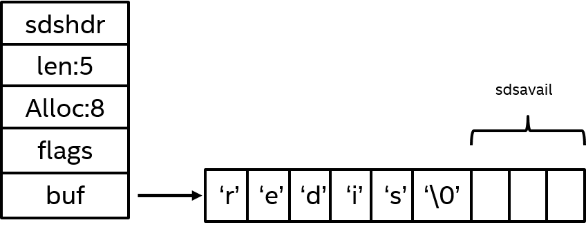

# Redis
## 集群机制
### 方案1：主从集群
一主多从。Master负责写、Slave负责读，Master收到数据写入同步到Slave节点。  
但是主从集群Master挂掉后不会从Slave选一个变成Master，Master出现故障无法自动恢复。
### 方案2：哨兵集群
基于主从集群的架构，增加了“哨兵”角色，当Master挂掉后，会从Slave中选一个升级为Master角色。  
但是哨兵集群缺点是无法在线扩容，写入性能依赖于单个Master节点。  
### 方案3：Redis Cluster
他是多主多从，有多个Master节点，每个Master节点又有自己的Slave节点。  
他实现了Redis的分布式存储，每个节点存储不同的数据，Redis Cluster

## 底层数据结构
Redis5种常用数据结构：字符串、列表、哈希、集合、有序集合，这些是Redis对外暴露的逻辑数据结构。

Redis底层数据结构有六种：
- 简单动态字符串
- 字典
- 整数集合
- 跳跃表
- 列表
- 压缩列表
- 快速列表

接下来将逐一介绍这六种数据结构，并说明Redis处于何种考虑进行这种设计。

### 简单动态字符串（SDS-simple dynamic string）
Redis中所有场景出现的字符串，基本都是有由SDS实现的。  
源码在：sds.h、sds.c

使用场景：
- 所有非数字key，例如： set msg "hello world" ，中的key msg
- 字符串数据类型的值，例如： set msg "hello world" ，中的value "hello world"
- 非字符串数据类型中的”字符串值“，例如：RPUSH fruits "apple" "banana" "cherry" ， 中的value "apple" "banana" "cherry"

SDS数据结构如下，Redis是C写的，遵循C字符串以空字符结尾的惯例。保存空字符串的1字节空间不计算在SDS的len属性里，申请空间时，会额外为空字符串申请1字节空间，并且不计算在alloc属性里，添加空字符串到末尾的操作也是由SDS函数自动完成，所以这个空字符串对开发者是完全透明的。

- len: 记录当前已使用的字节数（不包括'\0')
- alloc: 记录当前字节数组总共分配的字节数量（不包括'\0')
- flags: 标记当前字节数组的类型，是sdshdr8还是sdshdr16等
- buf: 字节数组，用于保存字符串，包括结尾空白字符串'\0' 

### 链表
列表底层是“链表”，该列表特点为：
